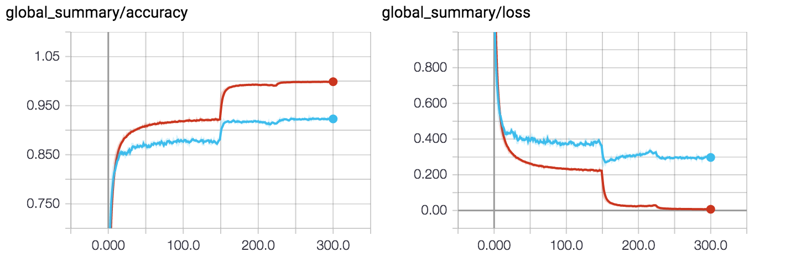

# TensorFlow implementation of DenseNet

This is my TensorFlow reimplementation of DenseNet, a neural network architecture that was published in [Densely Connected Convolutional Networks](http://arxiv.org/abs/1608.06993) by Gao Huang and Zhuang Liu.  DenseNet architecture is composed of dense blocks where every layer within a block is connected to every other layer within the same block.  The input of every layer is a concatenation of all previous layer inputs before it.  A layer is typically composed of the following ops BatchNorm->Relu->Conv2d->dropout.  Transition layers separate the dense blocks and also perform a pooling operation to reduce the size of the feature maps after every dense block operation.  Finally, a fully connected layer output layer performs a standard softmax loss with L2 regularization.

The original authors' Torch implementation can be found here : [https://github.com/liuzhuang13/DenseNet](https://github.com/liuzhuang13/DenseNet).


Figure 1: A dense block with 5 layers and growth rate 4. 


Figure 2: A deep DenseNet with three dense blocks. 

## Prerequisites

Python 3.5
Python 2.7 - I have not tested this on Python 2.7, but I welcome anyone who'd like to try it and provide me with feedback.

* TensorFlow 1.4+
* six
* numpy

## Usage

Default hyperparameters have already been specified.  However, they can be changed if so desired.  `--log_dir` and `--cifar10_dir` must be specified in order to execute the training script.  All other parameters can be left to default.

```
usage: train_cifar10.py [-h] [--lr LR] [--batch_size BATCH_SIZE]
                        [--epochs EPOCHS] [--print_every PRINT_EVERY]
                        [--keep_prob KEEP_PROB] [--growth_rate GROWTH_RATE]
                        [--reg REG] [--log_dir LOG_DIR]
                        [--cifar10_dir CIFAR10_DIR]

optional arguments:
  -h, --help            show this help message and exit
  --lr LR               learning rate
  --batch_size BATCH_SIZE
                        mini batch size
  --epochs EPOCHS       number of epochs to train
  --print_every PRINT_EVERY
                        print every n training steps
  --keep_prob KEEP_PROB
                        keep probability used during dropout
  --growth_rate GROWTH_RATE
                        growth rate
  --reg REG             L2 weight decay
  --log_dir LOG_DIR     Directory to store tensorboard summary and models.
                        Note that a timestamp named subdirectory inside
                        --log_dir will be created.
  --cifar10_dir CIFAR10_DIR
                        cifar10 dataset directory. The five training files and
                        one test file are expected to be named and be
                        identical to how they were released, python pickle
                        files named data_batch_n where n=[1,2,3,4,5] and
                        test_batch.
```

Assuming your environment is setup properly, simply execute the following to run the CIFAR-10 training script:

```
python train_cifar10.py --log_dir <log directory> --cifar10_dir <cifar10 dataset directory>
```

A summary of the loss and accuracy is written to disk every 50 training steps and a model is saved every epoch within the log directory.

## Implementation Details

Strong effort was made to keep the training details as close to the paper as possible.  This was trained on a single Nvidia GTX 1080 gpu and took 13+ hours.

* Training lasts 300 epochs
* MomentumOptimizer with learning rate 1e-1 and momentum 0.9.  Divide learning rate by 10 at epoch 150 and 225.
* Batch size 64
* Dropout probability of 0.2, ie. keep_prob = 0.8
* Growth rate k = 12
* Weight decay for L2 regularization 1e-4
* He initialization of convolutional filters and no convolutional bias

## Results

The figure below is a screenshot of the summary plots on TensorBoard after training and testing have completed on [CIFAR-10](https://www.cs.toronto.edu/~kriz/cifar.html).  Accuracy on the test set reaches nearly 93%.



## Citation

Citation of original publication found below.  However, the TensorFlow re-implementation is my own work and can be used freely for learning purposes.  

```
@article{Huang2016Densely,
  author = {Huang, Gao and Liu, Zhuang and Weinberger, Kilian Q.},
  title = {Densely Connected Convolutional Networks},
  journal = {arXiv preprint arXiv:1608.06993},
  year = {2016}
}
```

